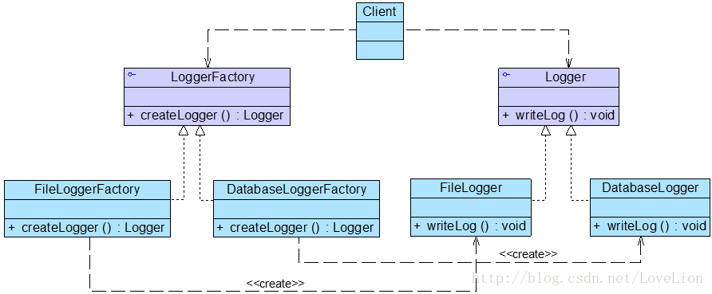

##博客
[史上最全设计模式导学目录（完整版）](https://blog.csdn.net/LoveLion/article/details/17517213)
[C++设计模式系列文章](https://zhuanlan.zhihu.com/p/94877789)

##设计模式概述
设计模式一般包含模式名称、问题、目的、解决方案、效果等组成要素，其中关键要素是模式名称、问题、解决方案和效果。
- **模式名称(Pattern Name)** 通过一两个词来描述模式的问题、解决方案和效果，以便更好地理解模式并方便开发人员之间的交流，绝大多数模式都是根据其功能或模式结构来命名的（GoF设计模式中没有一个模式用人名命名，微笑）
- **问题(Problem)** 描述了应该在何时使用模式，它包含了设计中存在的问题以及问题存在的原因
- **解决方案(Solution)** 描述了一个设计模式的组成成分，以及这些组成成分之间的相互关系，各自的职责和协作方式，通常解决方案通过UML类图和核心代码来进行描述
- **效果(Consequences)** 描述了模式的优缺点以及在使用模式时应权衡的问题

#####学习设计模式需要掌握的几点
1. 设计模式的意图是什么，主要解决一个什么问题，什么时候使用它
2. 掌握它的结构图，记住它的关键代码
3. 能够想到至少两个它的应用实例，一个生活中的，一个软件中的
4. 这个模式的优缺点是什么，在使用时要注意什么

###面向对象原则
面向对象设计原则也是我们用于评价一个设计模式的使用效果的重要指标之一
- 单一职责原则：一个类只负责一个功能领域中的相应职责
- 开闭原则：软件实体应对扩展开放，而对修改关闭
  
  *即软件实体应尽量在不修改原有代码的情况下进行扩展。*————————抽象化是开闭原则的关键。

- 里氏代换原则：所有引用基类对象的地方能够透明地使用其子类的对象
- 依赖倒转原则：抽象不应该依赖于细节，细节应该依赖于抽象
  
    依赖倒转原则要求我们在程序代码中传递参数时或在关联关系中，尽量引用层次高的抽象层类，即使用接口和抽象类进行变量类型声明、参数类型声明、方法返回类型声明，以及数据类型的转换等，而不要用具体类来做这些事情。

    开闭原则是目标，里氏代换原则是基础，依赖倒转原则是手段

- 接口隔离原则：使用多个专门的接口，而不使用单一的总接口
- 合成复用原则：尽量使用对象组合，而不是继承来达到复用的目的

    在面向对象设计中，可以通过两种方法在不同的环境中复用已有的设计和实现，即通过**组合/聚合关系** 或**通过继承** ，但首先应该考虑使用组合/聚合，组合/聚合可以使系统更加灵活，降低类与类之间的耦合度，一个类的变化对其他类造成的影响相对较少；其次才考虑继承，在使用继承时，需要严格遵循里氏代换原则，有效使用继承会有助于对问题的理解，降低复杂度，而滥用继承反而会增加系统构建和维护的难度以及系统的复杂度，因此需要慎重使用继承复用。
    继承复用会破坏系统的封装性，因为继承会将基类的实现细节暴露给子类
    一般而言，如果两个类之间是“Has-A”的关系应使用组合或聚合，如果是“Is-A”关系可使用继承。
- 迪米特法则：一个软件实体应当尽可能少地与其他实体发生相互作用

    不要和“陌生人”说话、只与你的直接朋友通信
    在迪米特法则中，对于一个对象，其朋友包括以下几类：
  
      (1) 当前对象本身(this)；
  
      (2) 以参数形式传入到当前对象方法中的对象；
  
      (3) 当前对象的成员对象；
  
      (4) 如果当前对象的成员对象是一个集合，那么集合中的元素也都是朋友；
  
      (5) 当前对象所创建的对象。

***
##六个创建型模式

###1. 简单工厂模式

**问题描述** ：开发一套图表库，该图表库可以为应用系统提供各种不同外观的图表，例如柱状图、饼状图、折线图等

Sunny软件公司图表库设计人员提出了一个初始设计方案，将所有图表的实现代码封装在一个Chart类中，其框架代码如下所示：

```
class Chart {
private String type; //图表类型
	public Chart(Object[][] data, String type) {
		this.type = type;
		if (type.equalsIgnoreCase("histogram")) {
			//初始化柱状图
		}
		else if (type.equalsIgnoreCase("pie")) {
			//初始化饼状图
		}
		else if (type.equalsIgnoreCase("line")) {
			//初始化折线图
		}
	}
	public void display() {
		if (this.type.equalsIgnoreCase("histogram")) {
			//显示柱状图
		}
		else if (this.type.equalsIgnoreCase("pie")) {
			//显示饼状图
		}
		else if (this.type.equalsIgnoreCase("line")) {
			//显示折线图
		}	
	}
```
问题：
    1. 包含很多“if…else…”代码块，整个类的代码相当冗长，代码越长，阅读难度、维护难度和测试难度也越大 
    2. 当需要增加新类型的图表时，必须修改Chart类的源代码，违反了“开闭原则”。
    3. 客户端只能通过new关键字来直接创建Chart对象，Chart类与客户端类耦合度较高，对象的创建和使用无法分离
    4. 客户端在创建Chart对象之前可能还需要进行大量初始化设置，例如设置柱状图的颜色、高度等，如果在Chart类的构造函数中没有提供一个默认设置，导致代码重复

**简单工厂模式** ：定义一个工厂类，它可以根据参数的不同返回不同类的实例，被创建的实例通常都具有共同的父类。因为在简单工厂模式中用于创建实例的方法是静态(static)方法，因此简单工厂模式又被称为静态工厂方法(Static Factory Method)模式，它属于类创建型模式。

- 具体产品类：需要创建的各种不同对象（例如各种不同的Chart对象）的相关代码封装到不同的类
- 抽象产品类：将它们公共的代码进行抽象和提取后封装在一个抽象产品类中，每一个具体产品类都是抽象产品类的子类
- 工厂类：用于创建各种产品，在工厂类中提供一个创建产品的工厂方法，该方法可以根据所传入的参数不同创建不同的具体产品对象

简单工厂模式的要点在于：当你需要什么，只需要传入一个正确的参数，就可以获取你所需要的对象，而无须知道其创建细节。简单工厂模式结构比较简单，其核心是工厂类的设计，其结构如图1所示：


**简单工厂基本实现流程**
由上述例子，可以很容易总结出简单工厂的实现流程：

1. 设计一个抽象产品类，它包含一些公共方法的实现；

2. 从抽象产品类中派生出多个具体产品类，如篮球类、足球类、排球类，具体产品类中实现具体产品生产的相关代码；

3. 设计一个工厂类，工厂类中提供一个生产各种产品的工厂方法，该方法根据传入参数（产品名称）创建不同的具体产品类对象；

4. 客户只需调用工厂类的工厂方法，并传入具体产品参数，即可得到一个具体产品对象。

[实现代码SampleFactory.cpp](1_sample_factory/SampleFactory.cpp)

`g++ SampleFactory.cpp -o main -std=c++11`

**简单工厂模式总结**

优点：工厂类提供创建具体产品的方法，并包含一定判断逻辑，客户不必参与产品的创建过程；
客户只需要知道对应产品的参数即可，参数一般简单好记，如数字、字符或者字符串等。

缺点：**违背了开闭原则（对扩展开放，对修改关闭），即在扩展功能时修改了既有的代码**

**方案的改进**

每更换一个Chart对象都需要修改客户端代码中静态工厂方法的参数，客户端代码将要重新编译，这对于客户端而言，违反了“开闭原则”，有没有一种方法能够在不修改客户端代码的前提下更换具体产品对象呢？答案是肯定的，下面将介绍一种常用的实现方式。

**适用场景**
在以下情况下可以考虑使用简单工厂模式：

    (1) 工厂类负责创建的对象比较少，由于创建的对象较少，不会造成工厂方法中的业务逻辑太过复杂。
    
    (2) 客户端只知道传入工厂类的参数，对于如何创建对象并不关心。

###2. 工厂方法模式
工厂方法模式中不再使用工厂类统一创建所有的具体产品，而是针对不同的产品设计了不同的工厂，每一个工厂只生产特定的产品。

**定义一个用于创建对象的接口，但是让子类决定将哪一个类实例化。工厂方法模式让一个类的实例化延迟到其子类。**

####工厂方法模式结构
**问题描述**    Sunny软件公司欲开发一个系统运行日志记录器(Logger)，该记录器可以通过多种途径保存系统的运行日志，如通过文件记录或数据库记录，用户可以通过修改配置文件灵活地更换日志记录方式。在设计各类日志记录器时，Sunny公司的开发人员发现需要对日志记录器进行一些初始化工作，初始化参数的设置过程较为复杂，而且某些参数的设置有严格的先后次序，否则可能会发生记录失败。如何封装记录器的初始化过程并保证多种记录器切换的灵活性是Sunny公司开发人员面临的一个难题。

从工厂方法模式简介中，可以知道该模式有以下几种角色：
- **抽象工厂（AbstractFactory）** ：所有生产具体产品的工厂类的基类，提供工厂类的公共方法；
- **具体工厂（ConcreteFactory）** :生产具体的产品
- **抽象产品（AbstractProduct）** :所有产品的基类，提供产品类的公共方法
- **具体产品（ConcreteProduct）** :具体的产品类

  
**完整解决方案**

Sunny公司开发人员决定使用工厂方法模式来设计日志记录器，其基本结构如图3所示：


在图中，Logger接口充当抽象产品，其子类FileLogger和DatabaseLogger充当具体产品，LoggerFactory接口充当抽象工厂，其子类FileLoggerFactory和DatabaseLoggerFactory充当具体工厂。完整代码如下所示：

[实现代码Factory.cpp](2_factory/Factory.cpp)

`g++ Factory.cpp -o main -std=c++11 -g`

####工厂方法模式总结
**优点** ：
- 工厂方法用于创建客户所需产品，同时向客户隐藏某个具体产品类将被实例化的细节，用户只需关心所需产品对应的工厂；
- 工厂自主决定创建何种产品，并且创建过程封装在具体工厂对象内部，多态性设计是工厂方法模式的关键；
- 新加入产品时，无需修改原有代码，增强了系统的可扩展性，符合开闭原则。

**缺点** :
- 添加新产品时需要同时添加新的产品工厂，系统中类的数量成对增加，增加了系统的复杂度，更多的类需要编译和运行，增加了系统的额外开销；
- 工厂和产品都引入了抽象层，客户端代码中均使用的抽象层（AbstractFactory和AbstractSportProduct ），增加了系统的抽象层次和理解难度。

**适用环境：**
- 客户端不需要知道它所需要创建的对象的类；
- 抽象工厂类通过其子类来指定创建哪个对象（运用多态性设计和里氏代换原则）


###3. 抽象工厂模式
抽象工厂模式，其抽象程度更高，每一个具体工厂可以生产一组相关的具体产品对象。

**抽象工厂模式：提供一个创建一系列相关或相互依赖对象的接口，而无需指定他们具体的类。**

####抽象工厂模式结构
抽象工厂模式结构与工厂方法模式结构类似，不同之处在于，一个具体工厂可以生产多种同类相关的产品：
- **抽象工厂（AbstractFactory）**：所有生产具体产品的工厂类的基类，提供工厂类的公共方法；
- **具体工厂（ConcreteFactory）**：生产具体的产品
- **抽象产品（AbstractProduct）**：所有产品的基类，提供产品类的公共方法
- **具体产品（ConcreteProduct）**：具体的产品类


**问题描述**    Jungle想要进行户外运动，它可以选择打篮球和踢足球。但这次Jungle不想弄脏原本穿的T恤，所以Jungle还需要穿球衣，打篮球就穿篮球衣，踢足球就穿足球衣。篮球保管室可以提供篮球和篮球衣，足球保管室可以提供足球和足球衣。Jungle只要根据心情去某个保管室，就可以换上球衣、拿上球，然后就可以愉快地玩耍了。


[实现代码AbstractFactory.cpp](3_abstract_factory/AbstratFactory.cpp)

`g++ AbstractFactory.cpp -o main -g -std=c++11`

**抽象工厂模式总结**   在抽象工厂模式中，增加新的产品族很方便，但是增加新的产品等级结构很麻烦，抽象工厂模式的这种性质称为“开闭原则”的倾斜性。

**优点**  

    1. 抽象工厂模式隔离了具体类的生成，使得客户并不需要知道什么被创建。由于这种隔离，更换一个具体工厂就变得相对容易，所有的具体工厂都实现了抽象工厂中定义的那些公共接口，因此只需改变具体工厂的实例，就可以在某种程度上改变整个软件系统的行为。
    2. 当一个产品族中的多个对象被设计成一起工作时，它能够保证客户端始终只使用同一个产品族中的对象。
    3. 增加新的产品族很方便，无须修改已有系统，符合“开闭原则”。

**缺点**

    增加新的产品等级结构麻烦，需要对原有系统进行较大的修改，甚至需要修改抽象层代码，这显然会带来较大的不便，违背了“开闭原则”

**适用场景**

    1. 用户无须关心对象的创建过程，将对象的创建和使用解耦
    2. 系统中有多于一个的产品族，而每次只使用其中某一产品族。通过配置文件等方式来使得用户可以动态改变产品族
    3. 属于同一个产品族的产品将在一起使用，这一约束必须在系统的设计中体现出来。同一个产品族中的产品可以是没有任何关系的对象，但是它们都具有一些共同的约束
    4. 产品等级结构稳定，设计完成之后，不会向系统中增加新的产品等级结构或者删除已有的产品等级结构。

###4. 单例模式
确保一个类只有一个实例，并提供一个全局访问点来访问这个唯一实例。

单例模式有3个要点： 只能有一个实例； 必须自己创建这个实例； 必须自己向整个系统提供这个实例。

**单例模式结构** 。为防止创建多个对象，其构造函数必须是私有的（外界不能访问）。另一方面，为了提供一个全局访问点来访问该唯一实例，单例类提供了一个公有方法getInstance来返回该实例。

[线程安全的单例模式代码实现](4_single_ton/main.cpp)

####单例模式总结

**优点**:单例模式提供了严格的对唯一实例的创建和访问;单例模式的实现可以节省系统资源
**缺点**:如果某个实例负责多重职责但又必须实例唯一，那单例类的职责过多，这违背了单一职责原则;
多线程下需要考虑线程安全机制;
单例模式没有抽象层，不方便扩展

**适用环境**:系统只需要一个实例对象;某个实例只允许有一个访问接口

###5. 原型模式
使用原型实例指定待创建对象的类型，并且通过复制这个原型来创建新的对象。

- **抽象原型类（AbstractPrototype）**：声明克隆clone自身的接口
- **具体原型类（ConcretePrototype）**：实现clone接口
- **客户端（Client）**：客户端中声明一个抽象原型类，根据客户需求clone具体原型类对象实例

**问题描述** 明天就是周一了，Jungle又陷入了苦恼中，因为作业还没完成。于是Jungle想拿着哥哥Single的作业来抄一份。虽然抄袭作业并不好，但是边抄边学借鉴一下也是可以的。于是乎，Jungle开始动起手来……


[实现代码PrototypePattern.cpp](5_prototype/main.cpp)

####原型模式总结
**优点：**

    当创建新的对象实例较为复杂时，原型模式可以简化创建过程，提高创建对象的效率；

    可扩展：模式中提供了抽象原型类，具体原型类可适当扩展；

    创建结构简单：创建工厂即为原型对象本身

**缺点：**

    深克隆代码较为复杂；

    每一个类都得配备一个clone方法，且该方法位于类的内部，修改时违背开闭原则；

**适用环境：**

    当创建新的对象实例较为复杂时，原型模式可以简化创建过程；
    
    结合优点第3条，需要避免使用分层次的工厂类来创建分层次的对象，并且类的实例对象只有一个或很少几个的组合状态，通过复制原型对象得到新实例，比通过使用构造函数创建一个新实例会更加方便。

###6. 建造者模式
建造者模式将客户端与包含多个部件的复杂对象的创建过程分离，客户端不必知道复杂对象的内部组成方式与装配方式（就好像Jungle不知道到底是如何把大象装进冰箱一样），只需知道所需建造者的类型即可。

**将一个复杂对象的构建与它的表示分离，使得同样的构建过程可以创建不同的表示。**
- **抽象建造者（AbstractBuilder）**：创建一个Product对象的各个部件指定的抽象接口；
- **具体建造者（ConcreteBuilder）**：实现AbstractBuilder的接口，实现各个部件的具体构造方法和装配方法，并返回创建结果。
- **产品（Product）**：具体的产品对象
- **指挥者（Director）**： 构建一个使用Builder接口的对象，安排复杂对象的构建过程，客户端一般只需要与Director交互，指定建造者类型，然后通过构造函数或者setter方法将具体建造者对象传入Director。它主要作用是：隔离客户与对象的生产过程，并负责控制产品对象的生产过程。


**问题描述** Jungle想要建造一栋简易的房子（地板、墙和天花板），两个工程师带着各自的方案找上门来，直接给Jungle看方案和效果图。犹豫再三，Jungle最终选定了一位工程师……交房之日，Jungle满意的看着建好的房子，开始思考：这房子究竟是怎么建成的呢？这地板、墙和天花板是怎么建造的呢？工程师笑着说：“It's none of your business”


[实现代码BuilderPattern.h](6_builder/main.cpp)

####建造者模式总结
从客户端代码可以看到，客户端只需指定具体建造者，并作为参数传递给指挥者，通过指挥者即可得到结果。客户端无需关心House的建造方法和具体流程。如果要更换建造风格，只需更换具体建造者即可，不同建造者之间并无任何关联，方便替换。从代码优化角度来看，其实可以不需要指挥者Director的角色，而直接把construct方法放入具体建造者当中。

**优点：**

    建造者模式中，客户端不需要知道产品内部组成细节，将产品本身和产品的创建过程分离，使同样的创建过程可以创建不同的产品对象；
    
    不同建造者相互独立，并无任何挂链，方便替换。

**缺点：**

    建造者模式所创建的产品一般具有较多的共同点，其组成部分相似，如果产品之间的差异性很大，则不适合使用建造者模式，因此其使用范围受到一定的限制。

    如果产品的内部变化复杂，可能会导致需要定义很多具体建造者类来实现这种变化，导致系统变得很庞大

**适用环境：**

    需要生成的产品对象有复杂的内部结构（通常包含多个成员变量）；

    产品对象内部属性有一定的生成顺序；

    同一个创建流程适用于多种不同的产品。

##七个结构型模式
###7. 适配器模式
在软件系统设计中，当需要组合使用的类不兼容时，也需要类似于变压器一样的适配器来协调这些不兼容者，这就是适配器模式！

**将一个类的接口转换成客户希望的另一个接口。适配器模式让那些接口不兼容的类可以一起工作。**

适配器模式分为类适配器和对象适配器。
- **适配器类（Adapter）**：适配器与适配者之间是继承或实现关系；
- **适配者类（Adaptee）**：适配器与适配者之间是关联关系。
- **目标抽象类（Target）**：定义客户所需要的接口。

**问题描述** 路径规划包括两个阶段：首先读取并解析工程图文件，得到其中的点、直线坐标；其次根据需求计算加工路径。软件控制器（Controller）上，系统点击“路径规划”按钮就自动完成上述过程。

Jungle已经封装好一个类DxfParser，该类可以读取后缀名为dxf的工程图文件，并解析其中的点、线，保存到路径列表里。另一个类PathPlanner用于计算加工路径。


###### `理解：将两个类通过包含的方式，包装到第三个类中。避免了两个类相互之间的联系 ，同时提供一个单一的接口类`

#### 适配器模式总结
**优点：**

    将目标类和适配者类解耦，引入一个适配器类实现代码重用，无需修改原有结构；

    增加类的透明和复用，对于客户端而言，适配者类是透明的；

    对象适配器可以把不同适配者适配到同一个目标（对象适配器）；

**缺点**

    对编程语言的限制：Java不支持多重继承，一次最多只能适配一个适配者类，不能同时适配多个适配者类；

**适用环境：**

    系统需要使用一些现有的类，但这些类的接口不符合系统需要，或者没有这些类的源代码；

    想创建一个重复使用的类，用于和一些彼此没有太大关联的类一起工作。

###8. 桥接模式
将抽象部分与它的实现部分解耦，使得两者都能够独立变化

**问题描述**新手机上能够迅速在新手机上安装（setup）并玩（play）游戏;新增加一个游戏时Jungle能够在已有手机上安装并play

手机是抽象类Abstraction，具有玩游戏这样的实现类接口Implementor，不同的手机品牌扩充抽象类RefinedAbstraction，多个不同的游戏则是具体实现类ConcreteImplementor。


[实现代码BridgePattern.cpp](8_Bridge/BridgePattern.cpp)

####桥接模式总结
**优点：**

    分离抽象接口与实现部分，使用对象间的关联关系使抽象与实现解耦；

    桥接模式可以取代多层继承关系，多层继承违背单一职责原则，不利于代码复用；

    桥接模式提高了系统可扩展性，某个维度需要扩展只需增加实现类接口或者具体实现类，而且不影响另一个维度，符合开闭原则。

**缺点：**

    桥接模式难以理解，因为关联关系建立在抽象层，需要一开始就设计抽象层；

    如何准确识别系统中的两个维度是应用桥接模式的难点。

**适用场景：**

    如果一个系统需要在抽象化和具体化之间增加灵活性，避免在两个层次之间增加继承关系，可以使用桥接模式在抽象层建立关联关系；

    抽象部分和实现部分可以各自扩展而互不影响；

    一个类存在多个独立变化的维度，可采用桥接模式。

###9. 组合模式
组合多个对象形成树形结构以表示具有部分-整体关系的层次结构。组合模式让客户端可以统一对待单个对象和组合对象。
- **Component（抽象构件）**：Component是一个抽象类，定义了构件的一些公共接口，这些接口是管理或者访问它的子构件的方法（如果有子构件），具体的实现在叶子构件和容器构件中进行。
- **Leaf（叶子构件）**：它代表树形结构中的叶子节点对象，叶子构件没有子节点，它实现了在抽象构件中定义的行为。对于抽象构件定义的管理子构件的方法，叶子构件可以通过抛出异常、提示错误等方式进行处理。
- **Composite（容器构件）** ：容器构件一方面具体实现公共接口，另一方面通过聚合关系包含子构件，子构件可以是容器构件，也可以是叶子构件。


**问题描述** 某个公司的组织结构分为总部、省级分部、市级分部和各个分部的行政办公室和教务办公室：


**实现代码**
[透明组合模式](9_composite/CompositePattern.cpp)      [安全组合模式](9_composite/CompositePattern_safe.cpp)

安全组合模式相比较透明组合模式，不同点在于：在安全组合模式中，抽象构件Component没有声明任何管理和访问子构件的方法，在具体的实现类中才去定义这些行为。之所以叫“安全”，是因为叶子构件没有子构件，也就不必定义管理访问子构件的方法，对客户端而言，当它处理子构件时，不可能调用到类似透明组合模式中的子构件的add、remove等方法，因此也就不会出错。

但是安全模式的不足在于客户端使用时必须有区别的对待叶子构件和容器构件。因为指向基类的指针只能访问基类有的成员函数，因此在定义过程中，需要声明子类指针（————详见程序）

####组合模式总结
**优点：**

    清楚地定义分层次的复杂对象，表示出复杂对象的层次结构，让客户端忽略层次的差异；

    客户端可以*一致地使用*层次结构中各个层次的对象，而不必关心其具体构件的行为如何实现；

    在组合模式中增加新的叶子构件和容器构件非常方便，易于扩展，符合开闭原则；

    为*树形结构*的案例提供了解决方案。

**缺点：**

    子构件或容器构件的行为受限制，因为它们来自相同的抽象层。*如果要定义某个容器或者某个叶子节点特有的方法，那么要求在运行时判断对象类型* ，增加了代码的复杂度。

**适用场景：**

    系统中需要用到*树形结构*；

    系统中能够分离出容器节点和叶子节点；

    具有整体和部门的层次结构中，能够通过某种方式*忽略层次差异*，使得客户端可以一致对待。

###10. 装饰模式
动态地给一个对象增加一些额外的职责。就扩展功能而言，装饰模式提供了一种比使用子类更加灵活的替代方案。

装饰模式是一种用于替代继承的技术。通过一种无须定义子类的方式给对象动态增加职责，使用对象之间的关联关系取代类之间的继承关系。装饰模式中引入了装饰类，在装饰类中既可以调用待装饰的原有对象的方法，还可以增加新的方法，以扩充原有类的功能。
- **Component（抽象构件）**：是具体构件类和装饰类的共同基类，声明了在具体构件中定义的方法，客户端可以一致的对待使用装饰前后的对象；
- **ConcreteComponent（具体构件）**：具体构件定义了构件具体的方法，装饰类可以给它增加更多的功能；
- **Decorator（抽象装饰类）**：用于给具体构件增加职责，但具体职责在其子类中实现。抽象装饰类通过聚合关系定义一个抽象构件的对象，通过该对象可以调用装饰之前构件的方法，并通过其子类扩展该方法，达到装饰的目的；
- **ConcreteDecorator（具体装饰类）**： 向构件增加新的功能。

**问题描述** 本节以给手机带上手机壳、贴上手机贴纸、系上手机挂绳为例，展示装饰模式的代码。该例的UML图如下所示：


[实现代码Decorator.cpp](10_decorator/Decorator.cpp)

注意：如果只有一个ConcreteComponent类，而没有抽象的Component类，则Decorator类可以是ConcreteComponent的子类。同理，如果只有一个ConcreteDecorator,则没有必要单独创建一个Decorator类

####组合模式总结
**优点：**

    对于扩展一个类的新功能，装饰模式比继承更加灵活；

    *动态扩展*一个对象的功能；

    可以对一个对象进行多次装饰（如上述例子第二个手机和第三个手机）；

    具体构件类和具体装饰类可以独立变化和扩展，符合开闭原则。

**缺点：**

    装饰模式中会增加很多小的对象，对象的区别主要在于各种装饰的连接方式不同，而并不是职责不同，大量小对象的产生会占用较多的系统资源；

    装饰模式比继承模式更灵活，但也更容易出错，更难于排错。

**适用场景：**

    在不影响其他对象的情况下，给单个对象动态扩展职责；

    不适宜采用继承的方式进行扩展的时候，可以考虑使用装饰模式。

###11. 外观模式
外观模式是一种使用频率较高的设计模式，它提供一个外观角色封装多个复杂的子系统，简化客户端与子系统之间的交互，方便客户端使用。外观模式可以降低系统的耦合度。如果没有外观类，不同的客户端在需要和多个不同的子系统交互，系统中将存在复杂的引用关系，如下图。引入了外观类，原有的复杂的引用关系都由外观类实现，不同的客户端只需要与外观类交互。


**为子系统中的一组接口提供一个统一的入口。外观模式定义了一个高层接口，这个接口使得这一子系统更加容易使用。**

- **Facade（外观角色）**：外观角色可以知道多个相关子系统的功能，它将所有从客户端发来的请求委派给相应的子系统，传递给相应的子系统处理。
- **SubSystem（子系统角色）**：子系统是一个类，或者由多个类组成的类的集合，它实现子系统具体的功能。

**问题描述** 电脑主机（Mainframe）中只需要按下主机的开机按钮（powerOn），即可调用其他硬件设备和软件的启动方法，如内存（Memory）的自检（selfCheck）、CPU的运行（run）、硬盘（HardDisk）的读取（read）、操作系统（OS）的载入（load）等。如果某一过程发生错误则电脑开机失败。


[实现代码FacadePattern.cpp](11_facade/FacadePattern.cpp)

####外观模式总结
**优点：**

    外观模式使得客户端不必关心子系统组件，减少了与客户端交互的对象的数量，简化了客户端的编程；

    外观模式可以大大降低系统的耦合度；

    子系统的变化并不需要修改客户端，只需要适当修改外观类即可；

    子系统之间不会相互影响。

**缺点：**

    如果需要增加或者减少子系统，需要修改外观类，违反开闭原则；

    并不能限制客户端直接与子系统交互，但如果加强限制，又使得系统灵活度降低。

**适用场景：**

    为访问一系列复杂的子系统提供一个统一的、简单的入口，可以使用外观模式；

    客户端与多个子系统之间存在很大依赖，但在客户端编程，又会增加系统耦合度，且使客户端编程复杂，可以使用外观模式。

###12. 享元模式
如果一个系统在运行时创建太多相同或者相似的对象，会占用大量内存和资源，降低系统性能。享元模式通过共享技术实现相同或相似的细粒度对象的复用，提供一个享元池存储已经创建好的对象，并通过享元工厂类将享元对象提供给客户端使用。

**运用共享技术有效地支持大量细粒度对象的复用**

享元对象能够做到共享的关键在于区分了内部状态和外部状态：
- **内部状态**：存储在享元对象内部，不会随着环境的改变而改变的，内部状态可以共享。比如围棋中棋子的形状、大小，不会随着外部变化而变化；比如字母A，无论谁使用，都是A，不会变化；
- **外部状态**：随环境变化而变化、不可以共享的状态，如棋子的位置、颜色，如每个字母的位置。外部状态一般由客户端保存，在使用时再传入到享元对象内部。不同的外部状态之间是相互独立的，棋子A和棋子B的位置可以不同，并且不会相互影响。

享元模式常常结合工厂模式一起使用，其结构包含抽象享元类、具体享元类、非共享具体享元类和享元工厂类：
- **Flyweight（抽象享元类）**：是一个抽象类，声明了具体享元类公共的方法，这些方法可以向外部提供享元对象的内部状态数据，也可以通过这些方法设置外部状态；
- **ConcreteFlyweight（具体享元类）**：具体实现抽象享元类声明的方法，具体享元类中为内部状态提供存储空间。具体享元类常常结合单例模式来设计实现，保证每个享元类对象只被创建一次，为每个具体享元类提供唯一的享元对象。
- **UnsharedConcreteFlyweight（非共享具体享元类）**：并不是所有抽象享元类的子类都需要被共享，可以将这些类设计为非共享具体享元类；
- **FlyweightFactory（享元工厂类）**：用于创建并管理享元对象，针对抽象享元类编程，将各种具体享元类对象存储在一个享元池中，享元池一般设计为一个存储键值对的集合（或者其他类型的集合），可结合工厂模式设计。客户需要某个享元对象时，如果享元池中已有该对象实例，则返回该实例，否则创建一个新的实例，给客户返回新的实例，并将新实例保存在享元池中。


**问题描述** 很多网络设备都是支持共享的，如交换机（switch）、集线器（hub）等。多台中断计算机可以连接同一台网络设备，并通过网络设备进行数据转发。本节Jungle将使用享元模式来模拟共享网络设备的实例。


[实现代码FlyweightPattern.cpp](12_flyweight/FlyweightPattern.cpp)
代码[FlyweightPattern_2.cpp](12_flyweight/FlyweightPattern_2.cpp)中，具体享元类采用单例模式

####总结
**优点：**

    享元模式通过享元池存储已经创建好的享元对象，实现相同或相似的细粒度对象的复用，大大减少了系统中的对象数量，节约了内存空间，提升了系统性能；

    享元模式通过内部状态和外部状态的区分，外部状态相互独立，客户端可以根据需求任意使用。

**缺点：**

    享元模式需要增加逻辑来取分出内部状态和外部状态，增加了编程的复杂度；

**适用环境：**

    当一个系统中有大量重复使用的相同或相似对象时，使用享元模式可以节约系统资源；

    对象的大部分状态都可以外部化，可以将这些状态传入对象中。

###13. 代理模式
给某一个对象提供一个代理或占位符，并由代理对象来控制对原对象的访问。

代理模式的关键是代理类（Proxy）。代理模式中引入了抽象层，客户端针对抽象层编程，这样使得客户端可以一致对待真实对象和代理对象。代理模式主要有抽象主题角色（Subject）、代理主题角色（Proxy）和真实主题角色（RealSubject）组成，其UML图如下：
- **抽象主题角色（Subject）**：声明了代理主题角色和真实主题角色共同的一些接口，因此在任何可以使用真实主题对象的地方都可以使用代理主题角色（想一想代购是不是也是这样？），客户端通常针对抽象主题编程；
- **代理主题角色（Proxy）**：代理主题角色通过关联关系引用真实主题角色，因此可以控制和操纵真实主题对象；代理主题角色中提供一个与真实主题角色相同的接口（以在需要时代替真实主题角色），同时还可以在调用对真实主题对象的操作之前或之后增加新的服务和功能；
- **真实主题角色（RealSubject）**：真实主题角色是代理角色所代表的真实对象，提供真正的业务操作，客户端可以通过代理主题角色间接地调用真实主题角色中定义的操作。


在实际开发过程中，代理模式产生了很多类型：
- 远程代理（Remote Proxy）：为一个位于不同地址空间的对象提供一个本地的代理对象。不同的地址空间可以在相同或不同的主机中。
- 虚拟代理（Virtual Proxy）：当创建一个对象需要消耗大量资源时，可以先创建一个消耗较少资源的虚拟代理来表示，当真正需要时再创建。 
- 保护代理（Protect Proxy）：给不同的用户提供不同的对象访问权限。
- 缓冲代理（Cache Proxy）：为某一个目标操作的结果提供临时存储空间，以使更多用户可以共享这些结果。
- 智能引用代理（Smart Reference Proxy）：当一个对象被引用时提供一些额外的操作，比如将对象被调用的次数记录下来等。

**问题描述** 在某应用软件中需要记录业务方法的调用日志，在不修改现有业务的基础上位每个类提供一个日志记录代理类，在代理类中输出日志，例如在业务方法method()调用之前输出“方法method()被调用，调用时间为2019-10-28 07:33:30”，调用之后输出“方法method()”调用成功。在代理类中调用真实业务类的业务方法，使用代理模式设计该日志记录模块的结构。


[实现代码ProxyPattern.cpp](13_proxy/ProxyPattern.cpp)

####总结
**优点：**

    代理模式能够协调调用者和被调用者，降低系统耦合度；

    客户端针对抽象主题角色编程，如果要增加或替换代理类，无需修改源代码，符合开闭原则，系统扩展性好；

    远程代理优点：为两个位于不同地址空间的对象的访问提供解决方案，可以将一些资源消耗较多的对象移至性能较好的计算机上，提高系统整体性能；

    虚拟代理优点：通过一个资源消耗较少的对象来代表一个消耗资源较多的对象，节省系统运行开销；

    缓冲代理优点：为某一个操作结果提供临时的存储空间，可以在后续操作中使用这些结果，缩短了执行时间；

    保护代理优点：:控制对一个对象的访问权限，为不同客户提供不同的访问权限。

**缺点：**

    增加了代理类和代理对象，增加了代理对象中的某些处理流程，可能会使得系统响应变慢；

    有的代理模式（如远程代理）实现代码较为复杂。

**适用环境：**

    当客户端对象需要访问远程主机中的对象——可以使用远程代理；

    当需要用一个资源消耗较少的对象来代表一个资源消耗较多的对象——虚拟代理；

    当需要限制不同用户对一个独享的访问权限——保护代理；

    当需要为一个频繁访问的操作结果提供临时存储空间——缓冲代理；

    当需要为一个对象的访问提供一些额外的操作——智能引用代理。

##十一个行为型模式
###14. 职责链模式
避免将一个请求的发送者和接收者耦合在一起，让多个对象都有机会处理请求。将接收请求的对象连接成一条链，并且沿着这条链传递请求，直到有一个对象能够处理它为止。

职责链模式又叫责任链模式。很多情况下，可以处理某个请求的对象可能不止一个，请求可以沿着某一条对象之间形成的关系一级一级由下家传递到上家，形成一条链——职责链。链上的每一个对象都是请求的处理者，客户端要做的仅仅是发送请求，不需要关心请求的处理细节过程。由此，职责链模式将请求者和请求的接收者解耦。


职责链模式中一共包含两个角色:
- **Handler（抽象处理者）**：抽象处理者一般为抽象类，声明了一个处理请求的接口handleRequest()，定义了一个抽象处理者类型的对象，作为其对下家的引用，通过该引用可以形成一条责任链。
- **ConcreteHandler（具体处理者）**： 是抽象处理者的子类，实现了处理请求的接口。在具体的实现中，如果该具体处理者能够处理该请求，就处理它，否则将该请求转发给后继者。具体处理者可以访问下一个对象。

**问题描述** 对于不同金额的票据，公司不同级别的领导处理情况如下：
- 金额0~10万：组长可处理
- 金额10~30万：主管处理
- 金额30~60万：经理处理
- 金额超过60万：老板处理


####总结
**优点：**

    将请求的接收者和处理者解耦，客户端无需知道具体处理者，只针对抽象处理者编程，简化了客户端编程过程，降低系统耦合度；

    在系统中增加一个新的处理者时，只需要继承抽象处理者，重新实现handleRequest()接口，无需改动原有代码，符合开闭原则；

    给对象分配职责时，职责链模式赋予系统更多灵活性。

**缺点：**

    请求没有一个明确的接收者，有可能遇到请求无法响应的问题；

    比较长的职责链，其处理过程会很长。

    建立职责链的工作是在客户端进行，如果建立不当，可能导致循环调用或者调用失败。

**适用环境：**

    有多个对象处理同一个请求，具体由谁来处理是在运行时决定，客户端只需发出请求到职责链上，而无需关心具体是谁来处理；

    可动态指定一组对象处理请求，客户端可以动态创建职责链来处理请求，还可以改变职责链中各个处理者之间的上下级关系。

###15. 命令模式

###16. 解释器模式

###17. 迭代器模式

###18. 中介者模式

###19. 备忘录模式

###20. 观察者模式

###21. 状态模式

###22. 策略模式

###23. 模板方法模式

###24. 访问者模式


